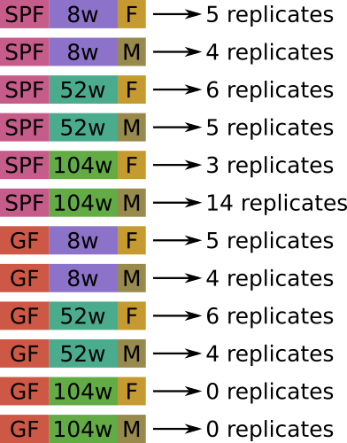

Data
====

We have RNA-seq data of microglya cells of mices for:
- both Conventional (SPF) and Germ free (GF)
- 3 ages: 8 weeks (8w), 52 weeks (52w), 104 weeks (104w)
- 2 genders: Male (m) and Female (f)
        

More details [here](https://docs.google.com/spreadsheets/d/1DL8pEVj5cvGflPIiaSPRXy-dMk2S7CxmnIk6Ubta2xs/edit?usp=sharing)
 
Library preparation and sequencing:
- Library preparation with Illumina Nextera XT Sample Preparation 
- First strand
- Single-end data
- Sequencing with HiSeq 1000