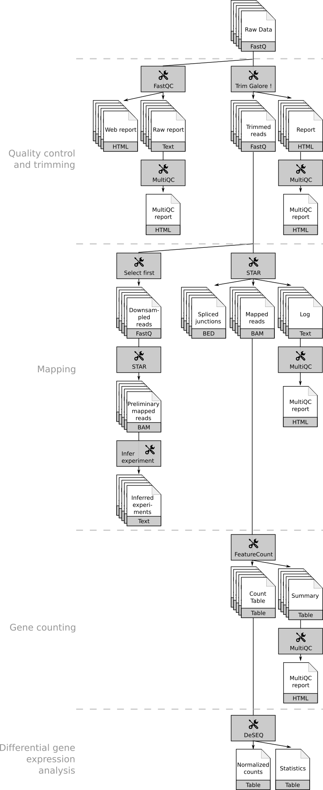
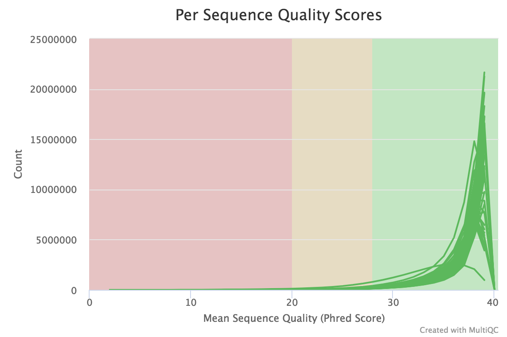
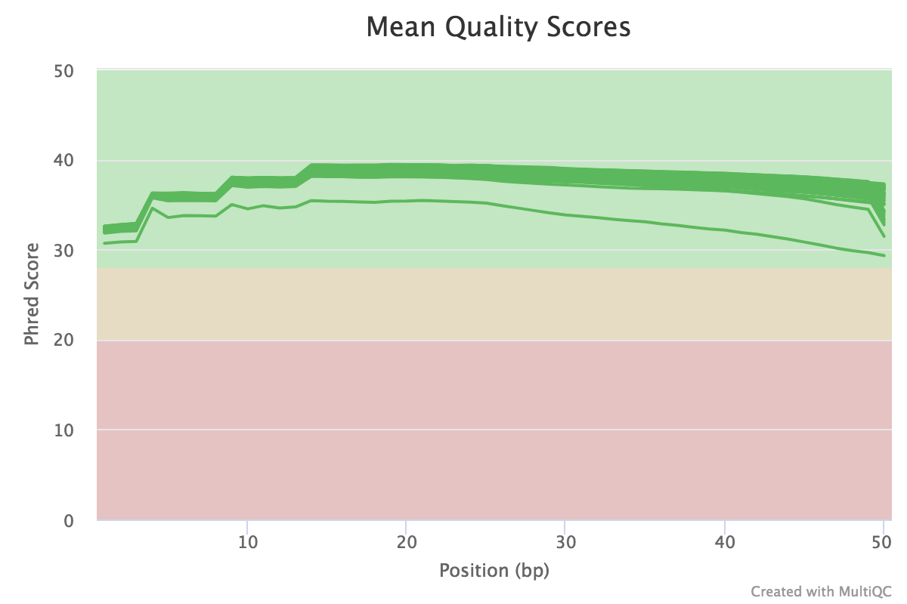
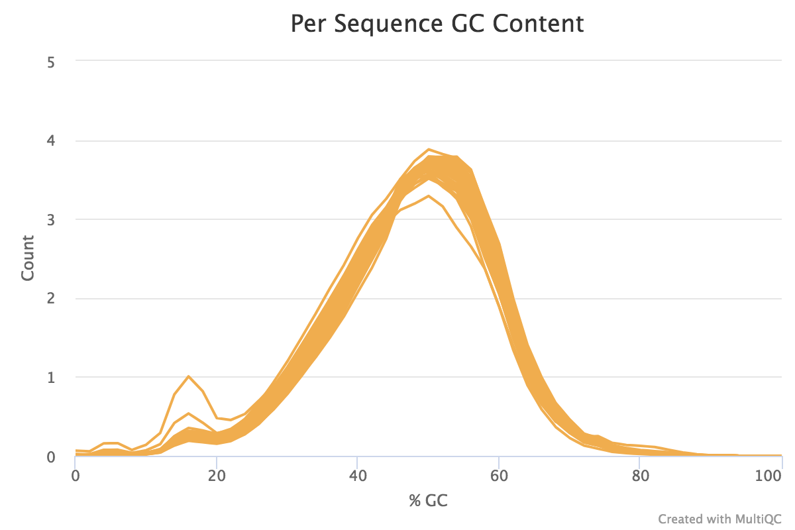
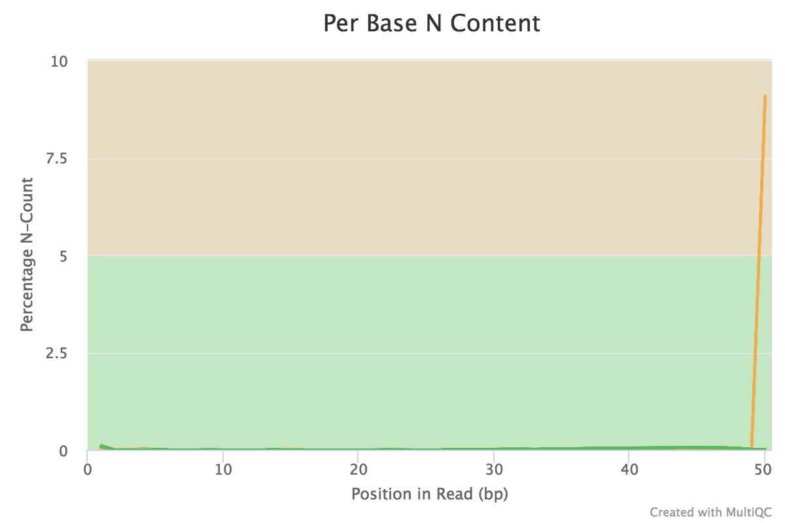
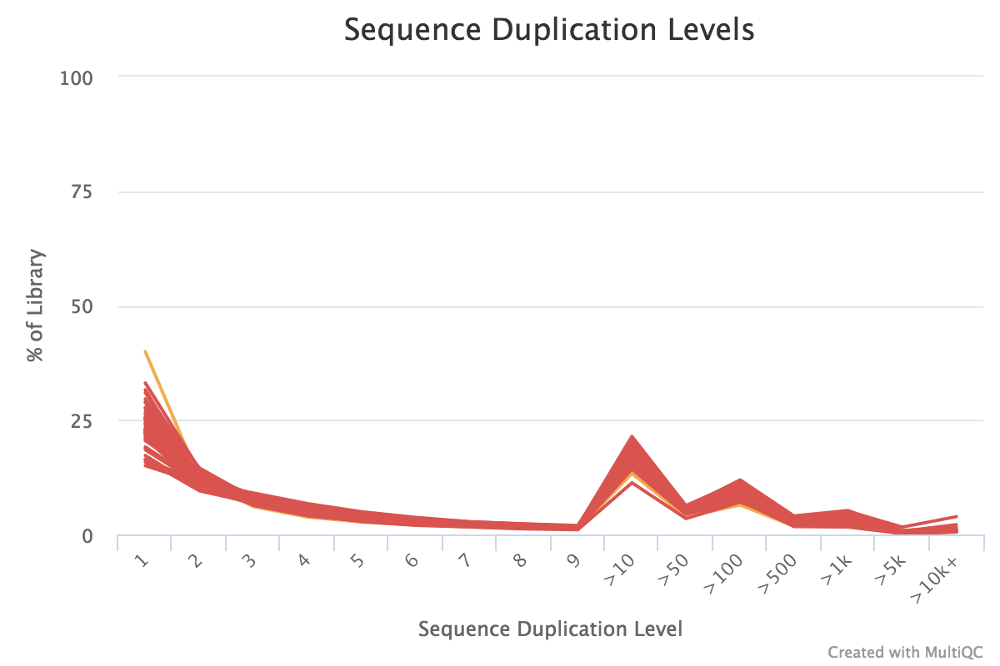
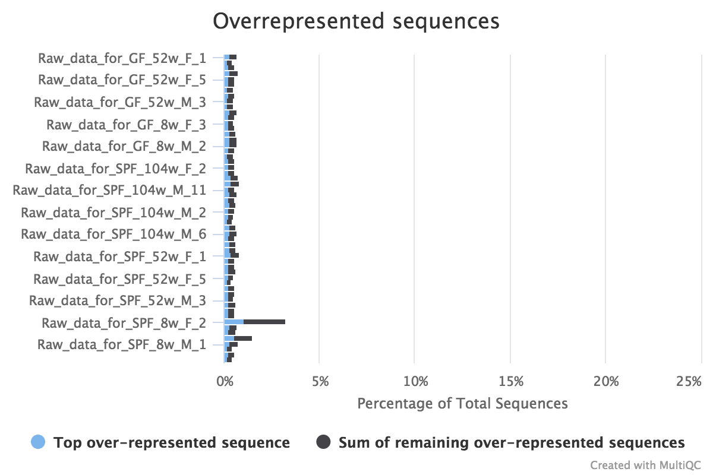
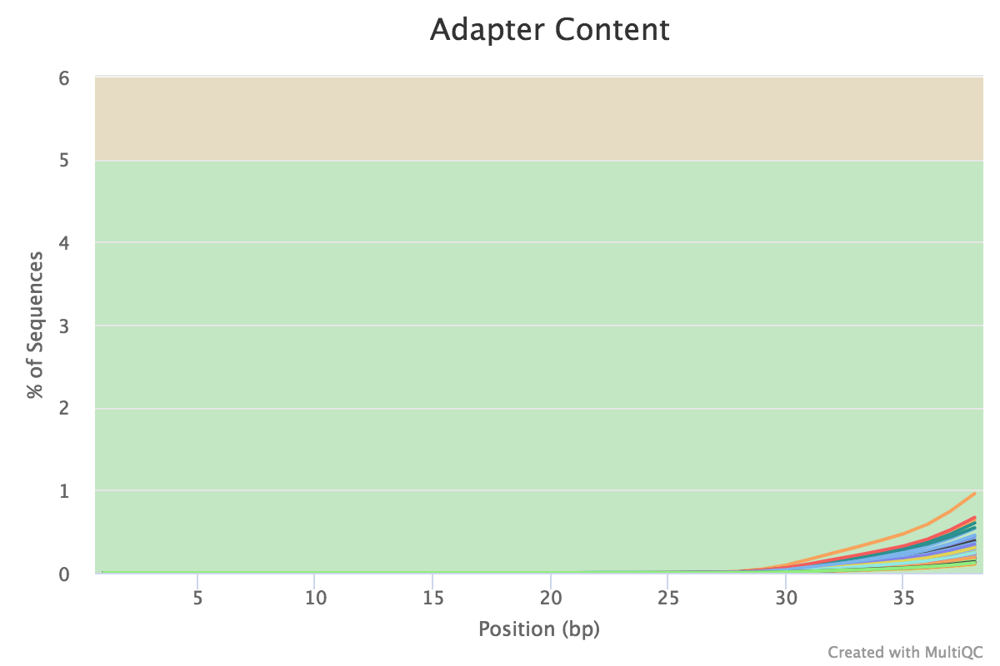
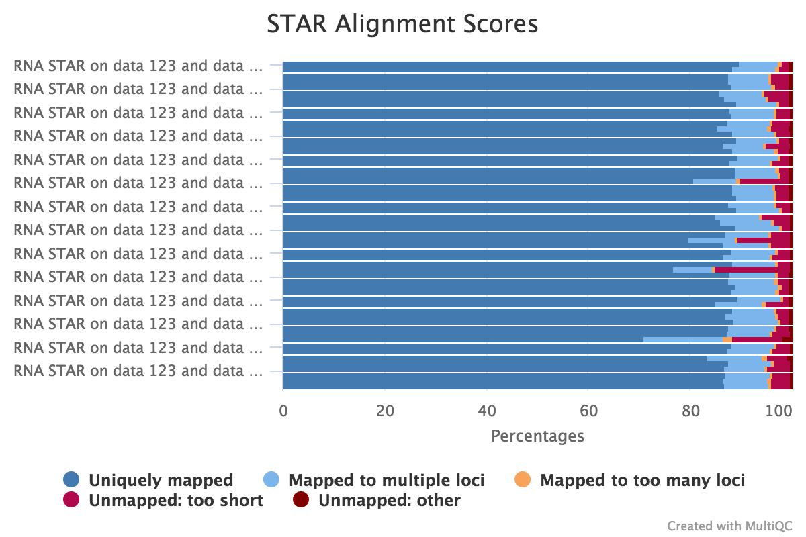

Extraction of number of reads mapped on each annotated genes for each samples
=============================================================================

# Analyses

Workflow applied on each dataset:

### Quality control and trimming

#### Quality control

Objectives

- Check the quality of the raw sequences

Details

- FastQC on every datasets
- MultiQC [@ewels2016multiqc] report to aggregate the FastQC reports

Results: (details in the [Google doc](https://docs.google.com/spreadsheets/d/1DL8pEVj5cvGflPIiaSPRXy-dMk2S7CxmnIk6Ubta2xs/edit?usp=sharing) in "FastQC report")

- Small sequences; 50 bp
- Between 22.4M and 52.2M of reads
- Good average quality score per sequence

    

- No big reduction of quality at the end of the sequences
    
    

- Per Base Sequence Content: 52 samples with a warning and 2 with an error (non homogenous proportion of each base at the beginning of the sequences)
- Per Sequence GC Content: all samples with a warning (small increase of %GC around 10-20 bp, likely related to the overrepresentation of C and G sequences at the begining seen in the previous check)

    

- Per Base N Content: 10 samples with a warning

    

- Numerous read duplications: expected for RNA seq data

    

- Overrepresented sequences: 55 samples with a warning and 1 with an error

    

    - Need to check with BLAST what are the overrepresented sequences

- Few remaining adapters at the end of the sequences

    

#### Trimming

Objectives

- Eliminate the bad quality ends, even if globally quality reports are good. Not so much removed

Details

- Trim Galore! on every datasets
- MultiQC [@ewels2016multiqc] report to aggregate the Trim Galore! reports

Results

- Few 3'-ends bases eliminated
- Few sequences eliminated (too small after trimming)
- To do
    - Add table with raw results
    - Fix MultiQC report aggregation

### Mapping

Objectives

- Map the reads on the reference genome of Drosophila

#### Preliminary mapping

Objectives

- Infer if the library is strand specific or not by
    - Extraction of some reads
    - Mapping them on the reference genome
    - Use an annotation file
    - Infer on gene of which strand the mapping reads fit on

Details

- Downsampling of the dataset: Extraction of 200,000 reads with "Select first" tool
- Mapping with
    - STAR [@dobin2013star]
    - mm10 as reference genome
- Infer the strand with "Infer Experiment" of RSeQC [@wang2012rseqc]

Results

- Unstranded library
- To do
    - Add table with raw results
    - Add MultiQC report aggregation

#### Actual mapping

Objectives

- Map the trimmed reads on the reference genome to annotate them

Details

- Mapping with
    - STAR [@dobin2013star], a splice aware mapper
    - mm10 as reference genome
    - mm10_UCSC_07_15_genes as gene model for splice junctions

Results: Details in the [Google doc](https://docs.google.com/spreadsheets/d/1DL8pEVj5cvGflPIiaSPRXy-dMk2S7CxmnIk6Ubta2xs/edit?usp=sharing) in "STAR report"

{ width=500px }

- Good percentage of reads that are uniquely mapped (> 70.9%)
- Good percentage of reads that are mapped (uniquely + multi-mapped, > 85%)
- Relatively low percentage of unmapped reads
- Keep an eye on
    - `SPF_8w_F_2`
    - `SPF_52w_F_6`
    - `SPF_52w_F_1`
    - `SPF_8w_M_1`

### Gene counting

Objectives

- Count the number of reads that are mapped on genes

Details

- Counting with
    - FeatureCounts [@liao2013featurecounts]
    - mm10_UCSC_07_15_genes as Gene annotation file
    - Unstranded protocol

Results Details in the [Google doc](https://docs.google.com/spreadsheets/d/1DL8pEVj5cvGflPIiaSPRXy-dMk2S7CxmnIk6Ubta2xs/edit?usp=sharing) in "FeatureCounts report"

- Good percentage of assigned reads to genes (> 60 % except 2 samples)
- Keep an eye on
    - `SPF_8w_F_2` (already issue for the mapping)
    - `SPF_8w_F_5`